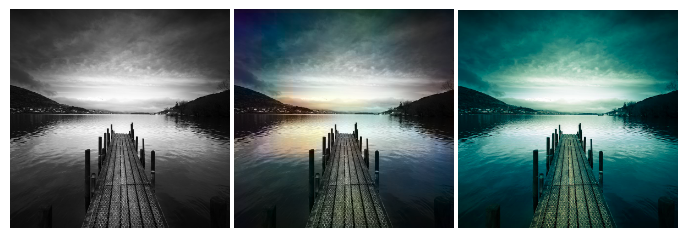

# image_colorization
## Grayscale image to colorful transformation - the aim is to get plausable colorful images which will "trick" the observer to give the feeling of a real RGB image

A VGG16 based CNN neaural network has been used, the schema is represented bellow:.

Training sets are taken from Kaggle, practically any dataset could be used which consists of colorfull images (it's suggested to use a particullar class of images e.g. portrait, landscape)
Below are some results: (trainings are done by using two loss functions, MSE(in the middle) and Euclidean distance(on the right))

